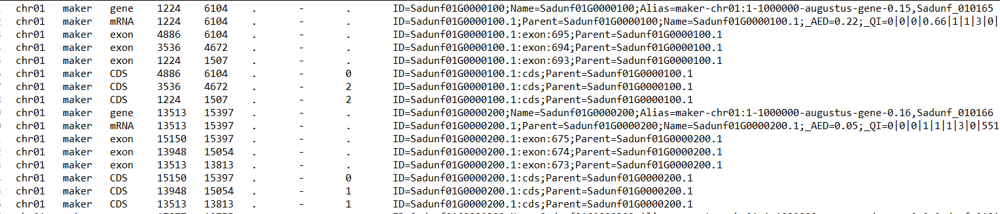
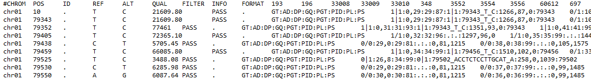
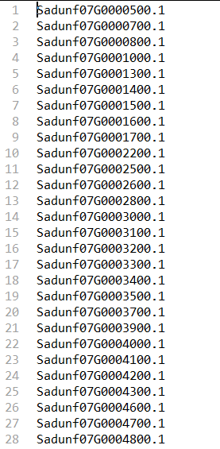

# VCFbox

Welcome to VCFbox! These box contains some tools for VCF. Version: 1.0


Requirement: 

* Python 3.x+
* Python module: vcf
* Python module: Bio


# List of Tools

<a href="#ExtractedSNPfromVCF">ExtractedSNPfromVCF</a>


# Tools

## <span name = "ExtractedSNPfromVCF">ExtractedSNPfromVCF</span>

### Introduction

This script can extract SNP from a singlecopy gene ID and GFF into individual fasta files by using VCF file


### Quick install & start

```python
#Install
git clone https://github.com/oasiswho/vcfbox
cd vcfbox

#Python 3.x+
pip install vcf
pip install Bio

#Start
python ExtractedSNPfromVCF.py -input samples.vcf -gff samples.gff -scg singlecopygenes.list -phy -snp 1 empty -keep
```


### Usage

```python
usage: ExtractedSNPfromVCF.py [-h] [-input VCF_file] [-gff GFF_file] [-scg SCG_file] [-snp snp_number] [-phy]{empty} ...
        
Input
  Input vcf file, gff file, single-copy genes list
-input VCF_file  input VCF file
  -gff GFF_file    input GFF file
  -scg SCG_file    input scg file

SNP
  screen genes under the snp number
  -snp snp_number  screen genes under the snp number

Output
  options for outputting format phy, the default parameter will output fasta
  -phy             output sequence with relaxed-phylip format

Empty
  Keep the gene or discard the gene
  -keep       Keep the gene if codon1-2 or codon3 is empty
  -discard    Discard the gene with empty codon1-2 or codon3

```


### Inputs

1. Chromosome level GFF file, only have longest transcript. (One gene, one mRNA)




2. Target VCF file




3. Single-copy genes ID list, this list corresponds to GFF file.




### Run

Run with default parameters:

```python
python ExtractedSNPfromVCF.py -input samples.vcf -gff samples.gff -scg singlecopygenes.list empty -keep
```

Output format phy

```python
python ExtractedSNPfromVCF.py -input samples.vcf -gff samples.gff -scg singlecopygenes.list -phy empty -keep
```

Gene screens by number of SNPs

```python
python ExtractedSNPfromVCF.py -input samples.vcf -gff samples.gff -scg singlecopygenes.list -snp 1 empty -keep
```

Discard all same name genes when one of the gene is empty

```python
python ExtractedSNPfromVCF.py -input samples.vcf -gff samples.gff -scg singlecopygenes.list empty -discard
```


Outputs:

```shell
codon1_2/
├── Sadunf07G0052900.1.fasta
├── Sadunf07G0052900.1.phy
├── Sadunf07G0054000.1.fasta
├── Sadunf07G0054000.1.phy
├── Sadunf07G0054100.1.fasta
├── Sadunf07G0054100.1.phy
├── Sadunf07G0054500.1.fasta
├── Sadunf07G0054500.1.phy
├── Sadunf07G0054600.1.fasta
├── Sadunf07G0054600.1.phy
├── Sadunf07G0054700.1.fasta
├── Sadunf07G0054700.1.phy
……
codon3
├── Sadunf07G0052900.1.fasta
├── Sadunf07G0052900.1.phy
├── Sadunf07G0054000.1.fasta
├── Sadunf07G0054000.1.phy
├── Sadunf07G0054100.1.fasta
├── Sadunf07G0054100.1.phy
├── Sadunf07G0054500.1.fasta
├── Sadunf07G0054500.1.phy
├── Sadunf07G0054600.1.fasta
├── Sadunf07G0054600.1.phy
├── Sadunf07G0054700.1.fasta
├── Sadunf07G0054700.1.phy
……
fullCDS/
├── Sadunf07G0052900.1.fasta
├── Sadunf07G0052900.1.phy
├── Sadunf07G0054000.1.fasta
├── Sadunf07G0054000.1.phy
├── Sadunf07G0054100.1.fasta
├── Sadunf07G0054100.1.phy
├── Sadunf07G0054500.1.fasta
├── Sadunf07G0054500.1.phy
├── Sadunf07G0054600.1.fasta
├── Sadunf07G0054600.1.phy
├── Sadunf07G0054700.1.fasta
├── Sadunf07G0054700.1.phy
……
```


### Custom modification

If you use gff which only have mRNA with no gene, you should change the code. e.g.

```python
if chr_id ==seq_id:
            #change type to mRNA .Modify the script to meet your demand.
			if type == 'mRNA':
				geneID = attributes.split(';')[0].split('=')[1]
				if geneID_flag != geneID and CDS_flag == 'true' :
					# SingleCopyID have '.1' in suffix, but gff don't , so I add up it.
					CDS_dict[geneID_flag] = CDS_list
					CDS_list = []
					CDS_flag='false'
					geneID_flag = geneID
				else:
					geneID_flag = geneID
```

 

## Update logs

V1.0 added python script ExtractedSNPfromVCF_V1.6


## Acknowledges

We thank Mingcheng Wang for his generous help for unselfishly providing ideas for python script ExtractedSNPfromVCF.