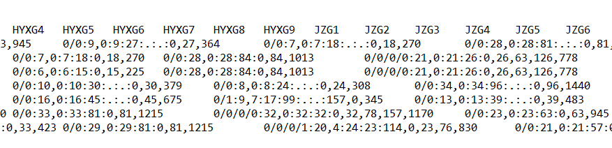
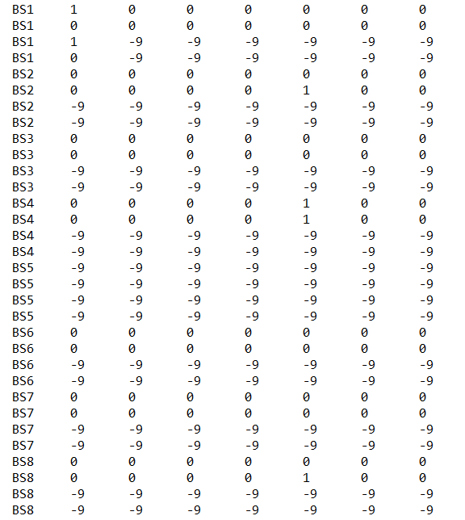

# VCFbox

Welcome to VCFbox! This box contains some tools for VCF(The Variant Call Format). Version: 1.3


Requirement: 

* Python 3.x+
* Python module: vcf
* Python module: Bio


# List of Tools

<a href="#ExtractSNPfromVCF">ExtractSNPfromVCF</a>

<a href="#VCFtoStructure">VCFtoStructure</a>


# Tools

## <span name = "ExtractSNPfromVCF">ExtractSNPfromVCF</span>

### Introduction

This script can be applied to extract SNPs from a VCF file by using a genes-ID list (e.g. single-copy genes). and a GFF file into an individual fasta file and a phy file.


### Quick install & start

```
#Install
git clone https://github.com/oasiswho/vcfbox
cd vcfbox

#Python 3.x+
pip install vcf
pip install Bio

#Start
python ExtractSNPfromVCF.py -input samples.vcf -gff samples.gff -scg singlecopygenes.list -phy -snp 1 empty -keep
```


### Usage

```
usage: main.py [-h] [-input VCF_file] [-gff GFF_file] [-scg SCG_file]
               [-snp snp_number] [-E Exclude_Gene] [-e Exclude_Sample] [-phy]
               {empty} ...
        
Input
  Input vcf file, gff file, single-copy genes list
-input VCF_file  input VCF file
  -gff GFF_file    input GFF file
  -scg SCG_file    input scg file

Exclude
  Exlude genes or samples
  -E Exclude_Gene    Exclude genes with >= value -E missing samples
  -e Exclude_Sample  Exclude genes with >= value -E missing data
SNP
  does not output genes with the number of SNPs less than was set
  -snp snp_number  does not output genes with the number of SNPs less than was set

Output
  options for outputting format phy, the default parameter will output fasta
  -phy             output sequence with relaxed-phylip format and fasta format

Empty
  Keep the gene or discard the gene
  -keep       Keep the gene if codon1-2 or codon3 is empty
  -discard    Discard the gene if codon1-2 or codon3 is empty

```


### Input

For the purpose of demonstration, files from the paper (see below) have been used:

> He L, Jia KH, Zhang RG, Wang Y, Shi TL, Li ZC, Zeng SW, Cai XJ, Wagner ND, Hörandl E, Muyle A, Yang K, Charlesworth D, Mao JF. Chromosome-scale assembly of the genome of Salix dunnii reveals a male-heterogametic sex determination system on chromosome 7. Mol Ecol Resour. 2021 Aug;21(6):1966-1982. doi: 10.1111/1755-0998.13362


1. Chromosome level GFF file, which only have the longest transcript in this file. (One gene, one mRNA)


2. Target VCF file


3. The list of genes-ID (Here are single-copy genes), the list should correspond to the GFF file. 

   

   

Tips: For the list of single-copy genes ID:

[OrthoFinder](https://github.com/davidemms/OrthoFinder) can be used to get an Orthogroups directory. And then use this command(see below) to get the list of single-copy genes ID.


```shell
grep -Fwf Orthogroups_SingleCopyOrthologues.txt Orthogroups.txt > full.SingleCopyGenesIDS.txt
```

Tips: For input files:

**The VCF file should have the same number of chromosome(or less) as the GFF file and the Single-copy gene file.**

**And all of them should have same order of chromosome, position.**

### Run

Run with default parameters:

```
python ExtractSNPfromVCF.py -input samples.vcf -gff samples.gff -scg singlecopygenes.list empty -keep
```

Output formats are phy and fasta

```
python ExtractSNPfromVCF.py -input samples.vcf -gff samples.gff -scg singlecopygenes.list -phy empty -keep
```

Output file does not contain the genes with the number of SNPs less than was set

```
python ExtractSNPfromVCF.py -input samples.vcf -gff samples.gff -scg singlecopygenes.list -snp 1 empty -keep
```

 The genes are discarded if codon1-2 or codon3 is empty

```
python ExtractSNPfromVCF.py -input samples.vcf -gff samples.gff -scg singlecopygenes.list empty -discard
```

The genes will be excluded when missing_samples >= 10%, and the samples will be excluded when miss_snps >=10%

```
python ExtractSNPfromVCF.py -input samples.vcf -gff samples.gff -scg singlecopygenes.list -E 0.1 -e 0.1 empty -keep
```

### Output:

```shell
codon1_2/
├── Sadunf07G0052900.1.fasta
├── Sadunf07G0052900.1.phy
├── Sadunf07G0054000.1.fasta
├── Sadunf07G0054000.1.phy
├── Sadunf07G0054100.1.fasta
├── Sadunf07G0054100.1.phy
├── Sadunf07G0054500.1.fasta
├── Sadunf07G0054500.1.phy
├── Sadunf07G0054600.1.fasta
├── Sadunf07G0054600.1.phy
├── Sadunf07G0054700.1.fasta
├── Sadunf07G0054700.1.phy
……
codon3
├── Sadunf07G0052900.1.fasta
├── Sadunf07G0052900.1.phy
├── Sadunf07G0054000.1.fasta
├── Sadunf07G0054000.1.phy
├── Sadunf07G0054100.1.fasta
├── Sadunf07G0054100.1.phy
├── Sadunf07G0054500.1.fasta
├── Sadunf07G0054500.1.phy
├── Sadunf07G0054600.1.fasta
├── Sadunf07G0054600.1.phy
├── Sadunf07G0054700.1.fasta
├── Sadunf07G0054700.1.phy
……
fullCDS/
├── Sadunf07G0052900.1.fasta
├── Sadunf07G0052900.1.phy
├── Sadunf07G0054000.1.fasta
├── Sadunf07G0054000.1.phy
├── Sadunf07G0054100.1.fasta
├── Sadunf07G0054100.1.phy
├── Sadunf07G0054500.1.fasta
├── Sadunf07G0054500.1.phy
├── Sadunf07G0054600.1.fasta
├── Sadunf07G0054600.1.phy
├── Sadunf07G0054700.1.fasta
├── Sadunf07G0054700.1.phy
……
```


### Custom modification

If the gff file with only  'mRNA'  instead of  'gene'  is used,  the code of the script should be changed. e.g.

```python
if chr_id ==seq_id:
            #change type to mRNA .Modify the script to meet your demand.
			if type == 'mRNA':
				geneID = attributes.split(';')[0].split('=')[1]
				if geneID_flag != geneID and CDS_flag == 'true' :
					# SingleCopyID have '.1' in suffix, but gff don't , so I add up it.
					CDS_dict[geneID_flag] = CDS_list
					CDS_list = []
					CDS_flag='false'
					geneID_flag = geneID
				else:
					geneID_flag = geneID
```

 

---

## <span name = "VCFtoStructure">VCFtoStructure</span>


### Introduction

This script can be applied to convert VCF file to STR file for the software of Structure . The output file types are diploid-tetraploid-mixed and diploid only and tetraploid only, simultaneously. The script was designed for VCF with **mixed-ploidy** SNP

**This python script has been adapted from [Ludovic Dutoit](https://github.com/ldutoit)**.


### Quick install & start

```
#Install
git clone https://github.com/oasiswho/vcfbox
cd vcfbox

#Python 3.x+
pip install vcf

#Start
python vcftostructure.py input.vcf out.str
```


### Usage

```
usage: vcf2structure.py [-h] input output

positional arguments:
  input       input VCF file
  output      output STRUCTURE DATA file

optional arguments:
  -h, --help  show this help message and exit
```


### Input

A VCF file contains mixed-ploidy SNPs.




### Run

```
python vcftostructure.py input.vcf out.str
```


### Output

The script will generate a STR file with tetraploid-inputing format for Structure.



**Digit codes stand for**: 0 Ref, 1 Alt, -9 missing.

In this particular case STR file, the **diploid site** will be treated as diploid in order to match the format for Structure input. **So the last two columns will be filled with -9.**

Table for converting code is given below

|   VCF   | STR(columns) |
| :-----: | :----------: |
|   0/0   |  0 0 -9 -9   |
|   0/1   |  0 1 -9 -9   |
|  0\|1   |  0 1 -9 -9   |
|   ./.   | -9 -9 -9 -9  |
|  .\|.   | -9 -9 -9 -9  |
| 0/0/0/0 |   0 0 0 0    |
| 0/0/0/1 |   0 0 0 1    |
| 0/0/1/1 |   0 0 1 1    |
| 0/1/1/1 |   0 1 1 1    |
| 1/1/1/1 |   1 1 1 1    |
| ./././. | -9 -9 -9 -9  |


### Output directory

```
├── dipoid.txt  #diploid with tetraploid format STR file
├── out.str #diploid-tetraploid-mixed STR file
├── input.vcf #input VCF file
├── tetraploid.txt #tetraploid STR file
└── vcftostructure.py #this script
```


## Citation


For ExtractSNPfromVCF

> Sergey Gulyaev, Xin-Jie Cai, Fei-Yi Guo, Satoshi Kikuchi, Wendy L Applequist, Zhi-Xiang Zhang, Elvira Hörandl, Li He* , The phylogeny of Salix revealed by whole genome re-sequencing suggests different sex-determination systems in major groups of the genus, Annals of Botany, 2022, mcac012, https://doi.org/10.1093/aob/mcac012


For VCFtoStructure

> https://github.com/ldutoit/personal_libraries

## Update logs

V1.3 added python script VCFtoStructure_V1.4

V1.2 update python script ExtractSNPfromVCF_V1.9

V1.1 update python script ExtractSNPfromVCF_V1.8

V1.0 added python script ExtractSNPfromVCF_V1.6


## Acknowledgments

We appreciate the help of [Mingcheng Wang](https://orcid.org/0000-0002-3631-9174) for providing ideas for python script ExtractSNPfromVCF. 

We appreciate the help of [Ludovic Dutoit](https://github.com/ldutoit) for providing professional script writing ideas and the open source spirit for python script VCFtoStructure.

We thank Sergey and [Hongpu Chen](https://hongpu-chen.github.io/) for their guidance and suggestions for this project.

